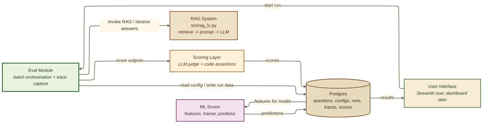

# Eval Module - Less Cluttered Mermaid Diagrams

## 1. Architecture Overview

```mermaid
%%{init: {"theme":"base","flowchart":{"defaultRenderer":"elk","curve":"basis","htmlLabels":true,"nodeSpacing":56,"rankSpacing":72,"padding":14},"themeVariables":{"fontFamily":"Inter, ui-sans-serif, system-ui, -apple-system, BlinkMacSystemFont, Segoe UI, sans-serif","fontSize":"15px","primaryTextColor":"#24301F","lineColor":"#6C5A43","edgeLabelBackground":"#FFF8EA"}}}%%

flowchart LR
    accTitle: Eval module architecture overview
    accDescr: A simplified architecture diagram showing the user interface, eval runtime, RAG system, scoring layer, ML scorer, and Postgres source of truth.

    classDef ui fill:#F7ECD4,stroke:#39723A,stroke-width:2px,color:#233D20;
    classDef core fill:#EAF3DE,stroke:#275B2E,stroke-width:2.6px,color:#203C22;
    classDef rag fill:#EFE1C7,stroke:#8B4D18,stroke-width:2px,color:#4A2D12;
    classDef score fill:#FFF1D9,stroke:#B3632C,stroke-width:2px,color:#5A3217;
    classDef ml fill:#F4E3EF,stroke:#7A356B,stroke-width:2px,color:#4B2542;
    classDef store fill:#E8DBBD,stroke:#6B4A26,stroke-width:2px,color:#352718;

    UI["User Interface<br/><i>Streamlit now; dashboard later</i>"]:::ui
    EVAL["Eval Module<br/><i>batch orchestration + trace capture</i>"]:::core
    RAG["RAG System<br/>src/rag_lc.py<br/><i>retrieve -> prompt -> LLM</i>"]:::rag
    SCORE["Scoring Layer<br/><i>LLM judge + code assertions</i>"]:::score
    ML["ML Scorer<br/><i>features, trainer, predictor</i>"]:::ml
    PG[("Postgres<br/><i>questions, configs, runs, traces, scores</i>")]:::store

    UI -->|"start run"| EVAL
    EVAL -->|"invoke RAG / receive answers"| RAG
    EVAL -->|"score outputs"| SCORE
    EVAL -->|"read config / write run data"| PG
    SCORE -->|"scores"| PG
    PG -->|"features for model"| ML
    ML -->|"predictions"| PG
    PG -->|"results"| UI

    linkStyle default stroke:#6C5A43,stroke-width:1.8px
```

## 2. Eval Batch Lifecycle

```mermaid
%%{init: {"theme":"base","flowchart":{"defaultRenderer":"elk","curve":"basis","htmlLabels":true,"nodeSpacing":52,"rankSpacing":72,"padding":14},"themeVariables":{"fontFamily":"Inter, ui-sans-serif, system-ui, -apple-system, BlinkMacSystemFont, Segoe UI, sans-serif","fontSize":"15px","primaryTextColor":"#24301F","lineColor":"#6C5A43","edgeLabelBackground":"#FFF8EA"}}}%%

flowchart LR
    accTitle: Eval batch lifecycle
    accDescr: A simplified staged view of an eval batch, from reading questions and configs through execution, scoring, ML signals, persistence, and reporting.

    classDef core fill:#EAF3DE,stroke:#275B2E,stroke-width:2.4px,color:#203C22;
    classDef rag fill:#EFE1C7,stroke:#8B4D18,stroke-width:2px,color:#4A2D12;
    classDef score fill:#FFF1D9,stroke:#B3632C,stroke-width:2px,color:#5A3217;
    classDef ml fill:#F4E3EF,stroke:#7A356B,stroke-width:2px,color:#4B2542;
    classDef store fill:#E8DBBD,stroke:#6B4A26,stroke-width:2px,color:#352718;
    classDef report fill:#F7ECD4,stroke:#39723A,stroke-width:2px,color:#233D20;

    PG[("Postgres<br/><i>questions, configs, prior runs</i>")]:::store
    PREP["1. Prepare Batch<br/><i>Test Set Manager</i><br/>questions + prompt/judge versions"]:::core
    EXEC["2. Execute RAG<br/><i>Orchestrator + LCEL chain</i><br/>answers, retrieval context, callback spans"]:::rag
    ASSESS["3. Score Outputs<br/><i>LLM judge + code assertions</i><br/>faithfulness, relevancy, citations, latency"]:::score
    LEARN["4. Learn + Persist<br/><i>feature extractor + ML scorer</i><br/>runs, traces, scores, predictions"]:::ml
    REPORT["5. Report Results<br/><i>Streamlit now; dashboard later</i>"]:::report

    PG -->|"questions + configs"| PREP
    PREP -->|"eval batch"| EXEC
    EXEC -->|"outputs + traces"| ASSESS
    ASSESS -->|"scores + signals"| LEARN
    LEARN -->|"write artifacts"| PG
    PG -->|"read results"| REPORT

    linkStyle default stroke:#6C5A43,stroke-width:1.8px
```
